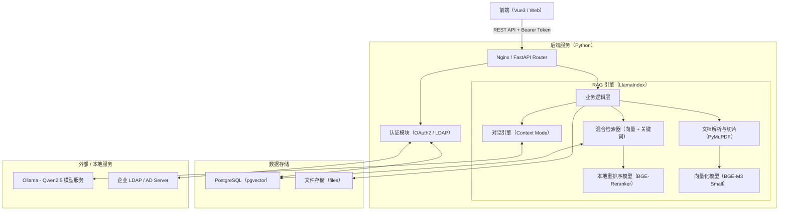
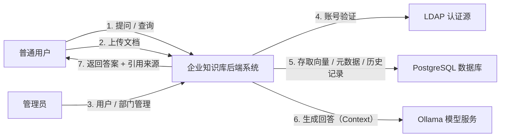

---

# 📚 Enterprise RAG Knowledge Base (Backend)

[](https://fastapi.tiangolo.com)
[](https://www.llamaindex.ai/)
[](https://ollama.com/)
[](https://www.postgresql.org/)
[](https://www.docker.com/)

基于 **LlamaIndex** 和 **FastAPI** 构建的企业级 RAG（检索增强生成）知识库后端系统。
支持完全私有化部署，具备多租户权限隔离、LDAP 统一认证、文档溯源高亮及会话持久化等企业级特性。
本项目是本人业余时间的开发成果，仅供学习交流使用，严禁商业用途（个人和企业可以免费使用）。

> **💡 说明**：本文档包含架构图和数据流图，推荐在 GitHub/GitLab 网页端查看，或在本地安装 Mermaid 预览插件。

---

## ✨ 核心特性

- **🔐 企业级安全架构**
  - **RBAC 权限控制**：基于角色的权限管理（管理员/普通成员）。
  - **多租户隔离**：通过 `workspace_id` 实现部门级数据物理/逻辑隔离。
  - **双模认证**：支持本地账号与 **LDAP/AD 域账号** 混合登录，自动同步组织架构。

- **🧠 全能型 RAG 引擎**
  - **Ollama 驱动**：LLM (`qwen2.5`) 和 Embedding (`bge-m3`) 均由 Ollama 服务统一管理，降低后端资源占用。
  - **精准重排序**：内置本地 **BGE-Reranker** 模型（打包于镜像中），大幅提升检索准确率。
  - **智能切片**：集成 PyMuPDF，支持 PDF/Word/Excel 等多格式文档的高精度解析与切分。

- **💬 深度交互体验**
  - **会话持久化**：完整保存历史对话记录，支持断点续聊。
  - **引用溯源**：返回精准的文档切片位置，支持前端 **PDF 原文高亮定位**。
  - **流式响应**：全异步 `StreamingResponse`，提供丝滑的打字机体验。

- **🐳 一键部署**
  - **开箱即用**：后端镜像内置 Reranker 模型，无需额外下载。
  - **容器编排**：提供完整的 `docker-compose.yml`，一键拉起全套服务。

---

## 🏗️ 系统架构设计

### 1. 整体技术架构图

系统采用 **计算分离** 架构：Ollama 负责繁重的生成与向量化计算，Python 后端负责业务逻辑与轻量级重排序。



### 2. 0层数据流图 (DFD Level-0)

描述了用户与系统及其外部实体的核心数据交互流程。



---

## 🛠️ 技术栈

*   **Runtime**: Python 3.10+
*   **Web Framework**: FastAPI
*   **RAG Framework**: LlamaIndex (v0.10+)
*   **Database**: PostgreSQL 16 (with `pgvector` extension)
*   **AI Engine**: 
    *   **Ollama**: 运行 `qwen2.5:3b` (Chat) 和 `bge-m3` (Embedding)
    *   **Local Python**: 运行 `BAAI/bge-reranker-base` (Rerank)
*   **Deployment**: Docker & Docker Compose

---

## 🚀 部署指南

### 前置条件

1.  宿主机安装 **Docker** 和 **Docker Compose**。
2.  宿主机安装 **Ollama** 并拉取所需模型：
    ```bash
    # 启动 Ollama (需允许外部访问)
    OLLAMA_HOST=0.0.0.0 ollama serve
    
    # 拉取模型
    ollama pull qwen2.5:3b
    ollama pull bge-m3
    ```

### 1. 构建与启动

后端 Docker 镜像构建时会将本地的 Reranker 模型打包进去，因此无需在部署服务器上额外下载 Python 模型。

```bash
# 在项目根目录执行
docker-compose up -d --build
```

### 2. 环境配置

核心配置在 `docker-compose.yml` 中：

```yaml
environment:
  - DB_HOST=db
  - OLLAMA_BASE_URL=http://host.docker.internal:11434  # 指向宿主机 Ollama
  - EMBED_MODEL_NAME=bge-m3       # 指定 Ollama 中的模型名
  - EMBEDDING_DIM=1024            # BGE-M3 的维度
```

### 3. 系统初始化

首次启动时，系统会自动执行以下初始化操作：
1.  **数据库**：自动创建表结构（包含向量表）。
2.  **组织架构**：创建默认公共部门 (`global`)。
3.  **管理员**：创建默认超级管理员账号。
    *   **账号**: `admin@internal.com`
    *   **密码**: `admin123` (请登录后立即修改)

---

## 📂 项目结构说明

```text
backend/
├── main.py                # 程序入口，负责 App 组装
├── rag_engine.py          # LlamaIndex 核心配置 (单例模式)
├── dependencies.py        # FastAPI 依赖注入 (DB, Auth)
├── database.py            # 数据库连接池
├── models.py              # SQLAlchemy 数据模型
├── routers/               # 业务路由模块
│   ├── auth.py            # 登录认证
│   ├── chat.py            # 问答与会话管理
│   ├── documents.py       # 文档上传、解析与切片
│   ├── files.py           # 文件预览流 (支持断点续传)
│   ├── admin.py           # 部门人员管理
│   └── dashboard.py       # 统计报表数据
├── test/                  # 测试脚本目录
│   └── init_ldap_data.py  # 测试用 LDAP 初始化脚本
├── files/                 # 持久化文件存储目录
├── init_sql/              # PG数据库初始化目录
│   └── init.sql           # PG数据库初始化脚本
├── models/                # 本地 Reranker 模型 (构建时打入镜像)
├── .env                   # 环境变量配置文件
├── requirements.txt       # Python 依赖列表
├── docker-compose.yml     # 容器编排配置文件（LDAP是测试用的可以删除）
└── Dockerfile             # 容器构建描述文件
```

---

## 🧪 开发与调试

如果需要在本地 (非 Docker) 环境开发：

1.  **准备环境**:
    ```bash
    conda create -n rag_backend python=3.10
    conda activate rag_backend
    pip install -r requirements.txt
    ```
2.  **准备模型**:
    请确保 `backend/models/bge-reranker-base` 目录下有模型文件。
3.  **启动服务**:
    ```bash
    python main.py
    ```
    访问 Swagger 文档：`http://localhost:8000/docs`

---
## 开发计划及进度：（目前处于第一阶段开发中...）
---

### 🚀 第一阶段：生产级部署 (DevOps)

**目标**：一条命令 `docker-compose up -d` 拉起所有服务（前端+后端+数据库+Ollama+LDAP），且开机自启。

1.  **前端 Docker化**：
    *   编写前端 `Dockerfile`。
    *   使用 **多阶段构建**：第一阶段 `node` 环境进行 `npm run build`，第二阶段用 `nginx:alpine` 承载构建好的静态文件 (`dist` 目录)。
    *   配置 Nginx 反向代理，把 `/api` 请求转发给后端容器。

2.  **后端 Docker化**：
    *   编写后端 `Dockerfile`。
    *   **关键点**：把本地下载好的 `models/` 目录 COPY 进镜像，确保镜像在此处断网也能跑。
    *   安装依赖建议使用 `requirements.txt`。

3.  **编排优化 (`docker-compose.yml`)**：
    *   将前端、后端、Postgres、Ollama 全部网络互通。
    *   配置 `restart: always`。
    *   配置数据卷挂载（特别是 `uploads/` 目录和 `pg_data`），防止重启丢数据。

---

### 🧠 第二阶段：RAG 效果深度调优 (Data Centric AI)

现在的 RAG 能跑通，但面对复杂问题可能还不够精准。

1.  **混合检索 (Hybrid Search)**：
    *   **痛点**：纯向量检索对于“精确匹配”（如搜索合同号 `HT-2023-001` 或专有名词）效果很差。
    *   **方案**：引入 **BM25 关键词检索**。LlamaIndex 支持 PGVector 的混合检索模式。
    *   **实现**：同时进行 `Vector Search` + `Keyword Search`，然后用 `Reciprocal Rank Fusion (RRF)` 算法合并结果，最后再 ReRank。

2.  **元数据增强 (Metadata Extraction)**：
    *   **方案**：在上传文档时，让 LLM 自动提取摘要、关键词、年份等元数据存入数据库。
    *   **效果**：用户可以问“2023年的财务报表”，系统能通过 Metadata Filter 精准过滤年份，而不是靠语义去猜。

3.  **复杂文档解析 (LlamaParse / OCR)**：
    *   **痛点**：现在的方案对于扫描件 PDF 还是无能为力。
    *   **方案**：引入 OCR 引擎（如 PaddleOCR）或接入云端解析服务（如果允许的话），处理表格和扫描件。

---

### 📈 第三阶段：运营与反馈 (Product Features)

让系统“活”起来，不仅能查，还能进化。

1.  **后台日志与监控**：
    *   集成 **LangFuse** 或 **Arize Phoenix**（LlamaIndex 原生支持）。
    *   **效果**：可以看到每一个 Request 的完整链路：检索了哪些块？相似度多少？LLM 输入了什么？输出了什么？耗时多少？
    *   这是排查“为什么 AI 胡说八道”的终极工具。

2.  **知识库“重索引”功能**：
    *   **痛点**：如果哪天想换更强的 Embedding 模型（比如 BGE-M4），现在的数据库就废了。
    *   **方案**：在后台增加一个“重建索引”按钮。后台任务自动读取 `uploads/` 目录下的源文件，重新切片、重新 Embedding 入库。

---

🧾 许可证与商业使用
---
本项目采用 **AGPL-3.0** 许可证，这意味着：

 - 您可以自由地使用、修改和分发本项目，但必须遵守 AGPL-3.0 协议要求
 - **闭源商用需要购买商业授权**
 - 项目的**重要贡献者**可免费获得商业授权

强烈建议优先考虑AGPL-3.0合规方案。如有**商业授权**疑问，请邮件联系作者
